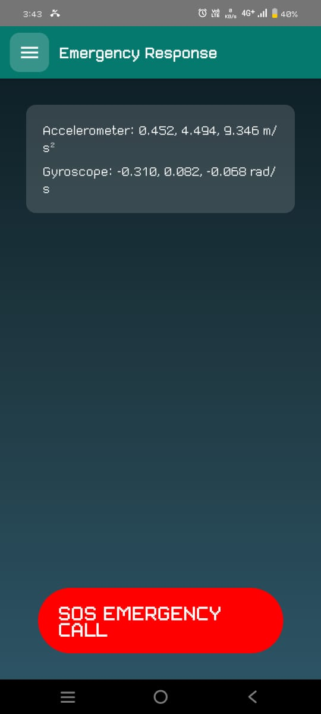
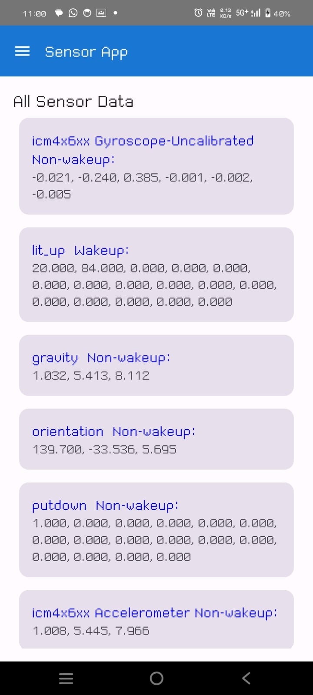

## Key Features ✨

- **Emergency SOS**  
  ⚡ Instant emergency call button with haptic feedback  
  📍 Automatic location sharing with emergency contacts

- **Real-time Sensor Monitoring**  
  🌀 Gyroscope orientation visualization  
  🌡️ Ambient temperature sensing

- **Health History**  
  📈 24-hour timeline of sensor data  
  📊 Interactive charts and graphs

## Getting Started 🚀

### Prerequisites

- Android Studio Flamingo (2022.2.1) or newer
- Android SDK 35 (Android 15)
- Java Development Kit (JDK) 17+

### First Time Setup

1. Configure emergency number in:
   ```xml
   <!-- app/src/main/res/values/strings.xml -->
   <string name="emergency_number">YOUR_LOCAL_EMERGENCY_NUMBER</string>
   ```
2. Enable sensor permissions in:
   ```kotlin
   // app/src/main/AndroidManifest.xml
   <uses-permission android:name="android.permission.BODY_SENSORS"/>
   ```

## Screenshots 📸

| Emergency SOS               | Sensor data                        |
| --------------------------- | ---------------------------------- |
|  |  |
